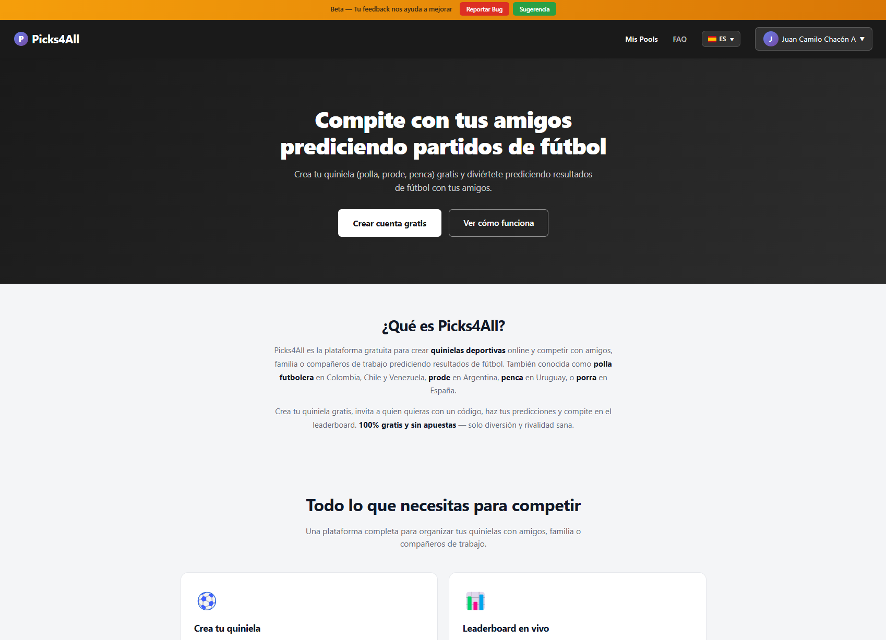
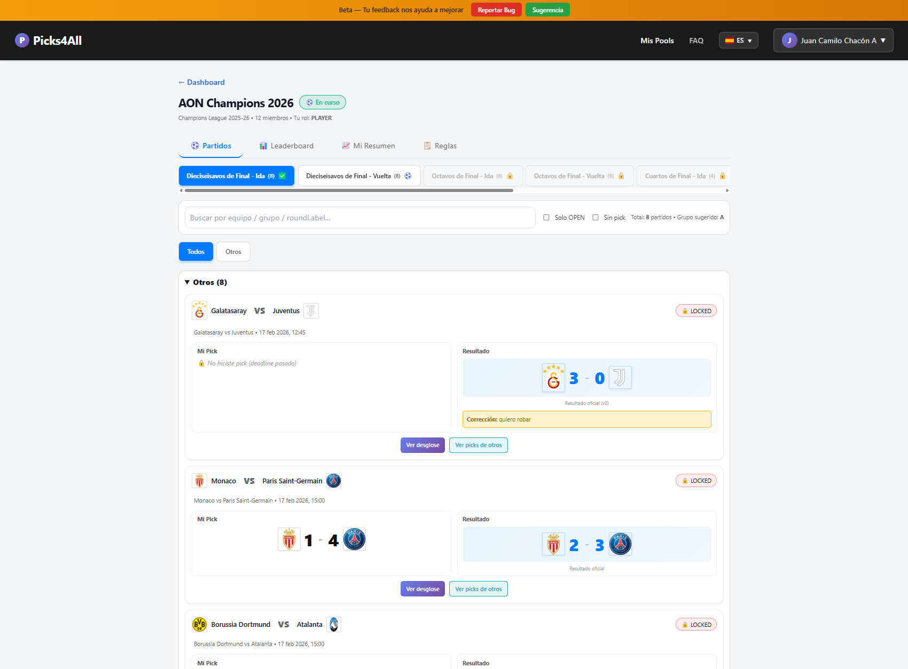

# Picks4All — Free Football Prediction Pools

[](https://picks4all.com)
[](LICENSE)
[](https://www.typescriptlang.org/)
[](https://nextjs.org/)
[](https://nodejs.org/)
[](https://www.postgresql.org/)

Create free football prediction pools and compete with friends, family, or coworkers. Predict match results for **World Cup 2026**, **Champions League**, and more.

Known as **quiniela** in Mexico, **polla futbolera** in Colombia, **prode** in Argentina, **penca** in Uruguay, and **porra** in Spain.





## Features

- **Create pools** — Set up your own prediction pool with custom scoring rules and deadlines
- **Invite with a code** — Share a simple invite code via WhatsApp or any messenger
- **Predict match scores** — Enter your picks before each match deadline
- **Live leaderboard** — Rankings update automatically after every match
- **Multi-tournament** — World Cup 2026, Champions League, and more
- **Multi-language** — Available in Spanish, English, and Portuguese
- **Google Sign-In** — One-click login with your Google account
- **Smart Sync** — Automatic score updates from live football data
- **100% free** — No real money, no gambling, just fun

## Tech Stack

| Layer | Technology |
|-------|-----------|
| **Frontend** | Next.js 16 (App Router), React 19, TypeScript |
| **Backend** | Node.js 22, Express, TypeScript |
| **Database** | PostgreSQL 16, Prisma ORM |
| **Auth** | JWT + Google Sign-In |
| **i18n** | next-intl (Spanish, English, Portuguese) |
| **Email** | Resend |
| **Deployment** | Railway |

## Project Structure

```
quiniela-platform/
├── backend/          # Express API + Prisma + Smart Sync
├── frontend-next/    # Next.js 16 App Router + i18n
├── docs/             # Architecture, API spec, business rules
└── infra/            # Docker Compose for local PostgreSQL
```

## Getting Started

### Prerequisites

- Node.js 22+
- Docker (for local PostgreSQL)

### Setup

```bash
# 1. Clone the repo
git clone https://github.com/Rastipunk/Quiniela-Platform.git
cd Quiniela-Platform

# 2. Start the database
cd backend
docker compose up -d

# 3. Backend
npm install
cp .env.example .env  # configure your environment variables
npx prisma migrate dev
npm run dev

# 4. Frontend (in a new terminal)
cd frontend-next
npm install
npm run dev
```

The app will be available at `http://localhost:3000`.

## Documentation

- [Architecture](docs/sot/ARCHITECTURE.md) — System design, tech stack, deployment
- [API Specification](docs/sot/API_SPEC.md) — All endpoints with examples
- [Data Model](docs/sot/DATA_MODEL.md) — Database schema and relationships
- [Business Rules](docs/sot/BUSINESS_RULES.md) — Scoring, deadlines, permissions

## Contributing

Contributions are welcome! Feel free to open an issue or submit a pull request.

## License

All rights reserved. See [LICENSE](LICENSE) for details.

---

**[picks4all.com](https://picks4all.com)** — Free football prediction pools with friends.
